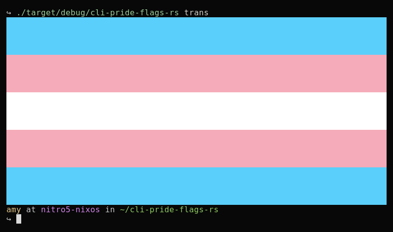

# cli pride flags rs



Implementation of https://github.com/ExperiBass/cli-pride-flags in rust <br>
Uses the same flags.json file/syntax for creating the flags and does the same

## just for fun: I tried to optimize it
here's the result: <br>
 <br>
*Yeah i know how to optimize, why do you ask?* <br>
If you want to see the "optimized" code, I put it in the optimized directory.

## Usage
```
USAGE:
    cli-pride-flags-rs [OPTIONS] <FLAG>

FLAGS:
        --help       Prints help information
    -V, --version    Prints version information

OPTIONS:
    -f, --file <FILE>        Sets a custom lson file to use
    -h, --height <HEIGHT>    Sets the height of the pride flag
    -w, --width <WIDTH>      Sets the width of the pride flag

ARGS:
    <FLAG>    Sets the flag to use
```
some examples: <br>
output the trans flag with the terminal width and automatic height: <br>
`cli-pride-flags-rs trans`

output the bi flag with a custom height: <br>
`cli-pride-flags-rs -h 10 trans`

output the enby flag with a custom width: <br>
`cli-pride-flags-rs -w 10 enby`

output the classic pride flag with both a custom height and width: <br>
`cli-pride-flags-rs -w 10 -h 10 classic`

output a custom flag from a custom json file <br>
`cli-pride-flags-rs -f custom.json -w 10 -h 10 <name of flag>`